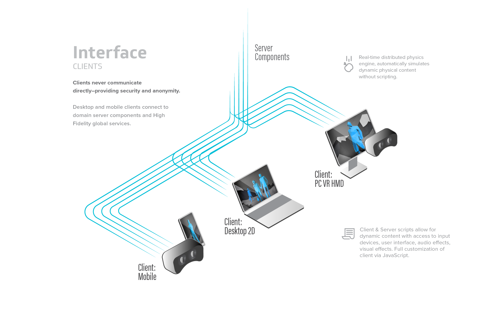
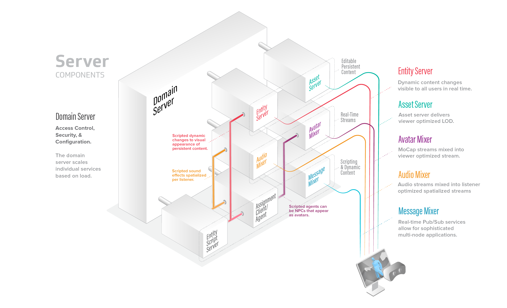
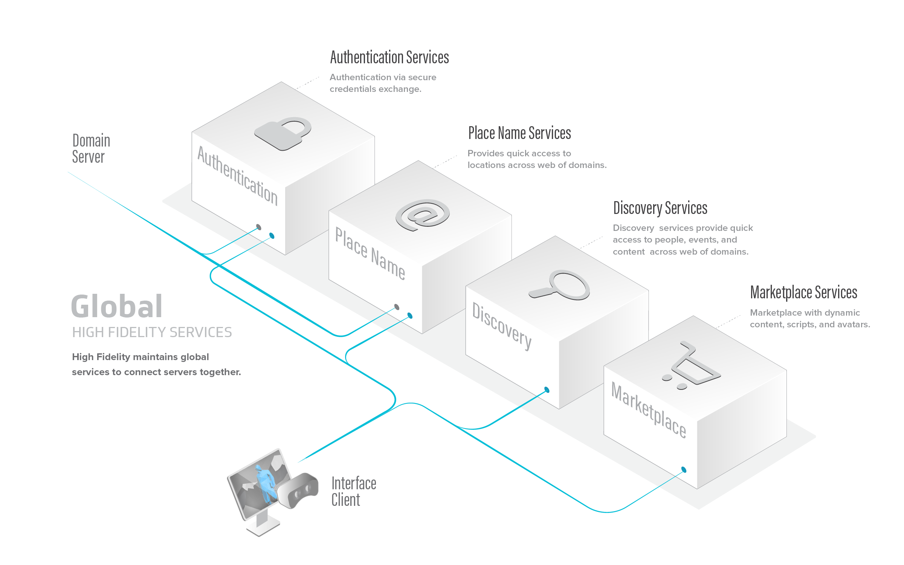

High Fidelity's architecture shows how different parts of the system work together to give you the best VR experience. 

**On This Page**

* [Architecture Overview](#architecture-overview)
* [High Fidelity Interface](#high-fidelity-interface)
* [Domain Server](#domain-server)
* [Global Services](#global-services)

## Architecture Overview
High Fidelity's architecture consists of the following components that work together and send data to each other for your VR experience. 

+ The [High Fidelity Interface](#interface) runs your personal experience in the metaverse. With it, you can [visit VR worlds](../../travel), [meet people](../../socialize), [attend live events](../../socialize#attend-live-events) and more.
+ The [Domain Server](#domain-server) is the server that hosts a domain. The domain server [hosts the content](../../../host/manage-your-domain-assets) in the domain, and manages the [domain-wide settings](../../../host/your-domain)configure-settings), such as audio spatialization, user permissions, and running scripts.
+ The [Global Services](#global-services) connect all of the servers together. These services are maintained by High Fidelity so that you can sign in, move seamlessly between places, and [purchase items on the Marketplace](../../bank-and-shop).

## High Fidelity Interface
The High Fidelity Interface (or simply 'Interface') is the main user interface for High Fidelity. It is used to explore the metaverse and engage with people from around the world. When you enter a domain, your Interface connects with the [domain server](#domain-server) that is hosting the virtual world, alongside any [global services](#global-services). 

You can download and use the Interface on your computer or your Android phone using the [Client-Only Installer](../install#client-only-installer). 

### Physics Engine
Your VR experience won't be realistic without some physics. High Fidelity includes a [physics engine](http://bulletphysics.org/) that simulates behaviors of objects according to the Newtonian laws of physics. When an object falls to the ground and bounces, or when two or more objects collide, their movements are computed by the physics engine. 

Each Interface runs its own physics engine, and the entity server coordinates the results to produce a consistent simulation across the entire domain.

## Domain Server
A domain is a spatial simulation in High Fidelity that you can visit. It is computed by a stack of programs on one or more computers. You need a domain's [place name](../../../host/add-a-place-name) to visit a domain, just like you would need a web address to visit a website. 

You can [set up your own domain](../../../host/your-domain) and host it on your local machine or on a cloud server to make it available to other users. Your domain's server stack is a set of components that simulate and manage different aspects of the domain such as audio, entities, and avatars. Everything that you see, hear, and do in your domain is managed by the server stack. 

### Server Stack
The Domain Server is at the top of this stack and its job is to give out assignments to the other components. These components are called Assignment Clients, because from the perspective of the domain server, they are clients that take on different roles.

The server stack is not only controlling, managing and computing your domain as you see it, but also how it is seen by anyone visiting your domain. This means that the domain server hands out simulation assignments and provides their IP addresses to connecting Interface clients. The domain server is a single executable that spawns assignment clients that become the different mixers as requested. Each assignment client can function as one of the six types mentioned. The domain server determines which assignment client functions as which mixer.

### Assignment Clients 
Assignment clients control and manage various aspects of a domain. They also communicate directly with the Interface clients connected to a domain. There are six types of assignment clients:

| Assignment Client | Description |
| ----------------- | ----------- |
| Avatar Mixer      | This mixer is in charge of your virtual presence in any domain. It keeps track of where you are, which avatar you're wearing, and how you move around the domain. For example, it tracks how you move your head while wearing a Head Mounted Display (HMD). |
|Audio Mixer | Mixes all sounds, whether it's voice or environmental. And it does this not just for avatars, but also for all the entities in a domain. The Audio mixer can customize a stereo mix for you based on your position relative to the audio source. |
| Entity Server | Tracks all entities and their properties in a domain, from their description and position, to any behaviors attached to them in a script. If an entity is modified, the change is communicated to the entity server, which in turn relays the information to all clients currently visiting the domain. |
| Asset Server | Provides copies of the models, audio files, scripts, and other media used by the domain. It functions like a Web server, but using protocols tuned to High Fidelity's architecture. |
| Agent | Executes user-written JavaScript programs. If you've written a script to get your avatar to clap, or create a bowling alley, the Agent will execute it. It can see entities, avatars, and send audio. |
| Messages Mixer | Provides communication between scripts running in different programs connected to the domain, which could be Interfaces or Agents. |

>>>>> Sandbox manages all these components on the domain server, five dedicated assignment clients, and as many agent assignments clients as needed. However, it is possible to spread the assignment clients over multiple computers, and even to divide each function among a hierarchy of assignment components, which may be on different computers. For instance, multiple audio mixers could be used to mix the audio in different geographic regions of the domain.

## Global Services
High Fidelity maintains global services to connect different servers together. 

**See Also**

+ [Install High Fidelity](../install)
+ [Host Your Domain](../../../host)
+ [Travel Between Worlds](../../travel)
