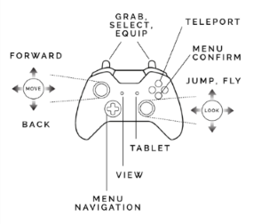

To get the best and most immersive experience in High Fidelity, you should use VR equipment such as the Oculus Rift or HTC Vive. Only then will you be able to interact with people in 3D, track body movements, and easily engage with the objects around you. On this page, you can find the controls on your VR controllers so that you can enjoy your experience in High Fidelity to the fullest.

>>>>>If you want to jump and fly in VR, you must enable it under Settings > Controls > VR Movement.

## Gamepad
While the use of a gamepad is supported, High Fidelity is best experienced with hand controllers like the Oculus Touch, HTC Vive, and Microsoft MR controllers.

Don't have your own VR equipment? You can still use High Fidelity in [desktop mode](../keyboard-shortcuts).