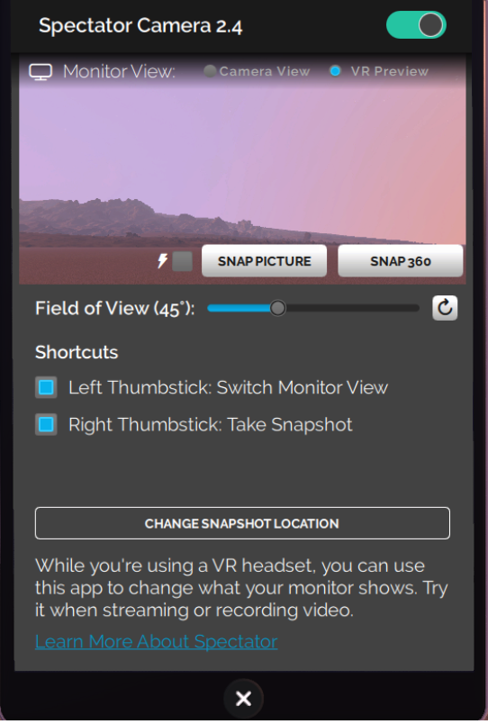

You can enhance your experience in High Fidelity by installing apps from the Marketplace. These apps enable you to get more out of High Fidelity. Do you want to record your avatar dancing, take selfies, or finger paint? Or are you looking to livestream to YouTube or make your avatar clap? Our Marketplace has a number of apps that can help you customize your experience in-world. 

On this page:

* [Install an App]($install-an-app)
* [Our Marketplace Apps](#our-marketplace-apps)

  * [Spectator Cam: Record or Livestream in High Fidelity](#spectator-cam)

  * [Finger Painting](#finger-painting)

## Install an App

We and many users have created apps that are available in High Fidelity's Marketplace. To find and install an app:

*  Go to **Market** on your HUD or Tablet. and click 'Categories'.
*  Select 'Apps, Scripts, & Tools' from the dropdown to take a look at what's available. You can also type 'app' in the search bar. Apps can be free or may be purchased at the listed price. If an app is not free, set up your [Wallet](#set-up-your-wallet) before purchasing anything on the Marketplace.
*  Click the app of your choice to purchase it. Once you've purchased your app, you can view it in your **Inventory** or **Recent Activity**. 
*  Click **Install App**.
*  Once the app is installed, click **Open App** to launch. You can also access the app through your HUD or Tablet.

## Our Marketplace Apps

We've listed some of the apps we created and how you can use them. 

### Spectator Cam

The Spectator Camera is a camera you can use, along with recording software such as [Open Broadcaster Software (OBS)](https://obsproject.com/), to record or livestream what you and your friends do in High Fidelity. 

>>>>> You can use the Spectator Camera only while using an HMD.

You can record or livestream what you see through your Spectator Camera using OBS. Check out their [official overview guide](https://obsproject.com/forum/threads/official-overview-guide.402/) for more details.

#### Get the Spectator Camera

* On your HUD or Tablet, go to **Market**.
* Search for the Spectator Camera. 
* Install the app.

>>> While using the Spectator Camera, Interface's framerate might be affected. This is because Interface is rendering not only what you see, but what the Spectator Camera sees as well. 

#### Use the Spectator Camera

* Click on the Spectator app on your tablet. 
* Turn on your Spectator Camera by clicking the "Spectator Cam On" checkbox. You'll see the camera appear in-world. The display on the app will show you what you see in VR through your HMD. This is to show you what you're recording without having to take off your HMD. 
* You can also see what your camera is capturing on the display above the lens. If you switch to "Camera View" from "HMD Preview" on the tablet, the Tablet preview also switch to the camera view. 
* You can switch between views using your controllers so that you don't have to pull up your tablet to do so every time. This allows you to switch views without viewers noticing. You can enable this on your tablet in the spectator cam app. 
  * Rift: If you're using Oculus Touch controllers, click the left thumbstick to switch views. 
  * Vive: If you're using HTC Vive controllers, press on the center of the thumb pad to switch views. 

### Finger Painting 

The Fingerpaint app allows you to paint your environment, your own avatar, or even another user's avatar. 

#### Get the Fingerpaint App

- On your HUD or Tablet, go to **Market**.
- Search for the Fingerpaint App. 
- Install the app.

#### Using the Fingerpaint App

* On your HUD or Tablet, go to **Body Paint** and open the app.
* First, select what you would like to paint on - the world around you, your avatar, or another user's avatar (with their permission). Do this by clicking **Options** and selecting your choice. 
* Click **Palette** to select a color for your paint. 
* Click **Brushes** to select the settings for your brush, such as stroke width, type of brush, and special effects.