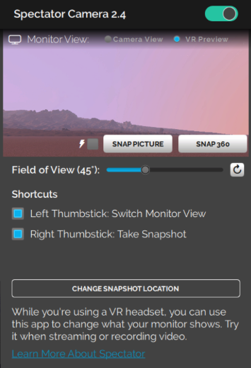

You can enhance your experience in High Fidelity by installing apps from the Marketplace. These apps enable you to get more out of High Fidelity. Do you want to record your avatar dancing, take selfies, or finger paint? Or are you looking to livestream to YouTube or make your avatar clap? Our Marketplace has a number of apps that can help you customize your experience in-world. 

On this page:

* [Install an App]($install-an-app)
* [Our Marketplace Apps](#our-marketplace-apps)
  * [Spectator Cam: Record or Livestream from High Fidelity](#spectator-cam)
  * [Shapes: Create in VR](#shapes-create-in-vr)

## Install an App

We and many users have created apps that are available on High Fidelity's Marketplace. To find and install an app:

*  Go to **Market** on your HUD or Tablet. and click 'Categories'.
*  Select 'Apps, Scripts, & Tools' from the dropdown to take a look at what's available. You can also type 'app' in the search bar. Apps can be free or may be purchased at the listed price. If an app is not free, set up your [Wallet](#set-up-your-wallet) before purchasing anything on the Marketplace.
*  Click the app of your choice to purchase it. Once you've purchased your app, you can view it in your **Inventory** or **Recent Activity**. 
*  Click **Install App**.
*  Once the app is installed, click **Open App** to launch. You can also access the app through your HUD or Tablet.

## Our Marketplace Apps

We've listed some of the apps we created and how you can use them. 

### Spectator Cam

The Spectator Camera is a camera you can use, along with recording software such as [Open Broadcaster Software (OBS)](https://obsproject.com/), to record or livestream what you and your friends do in High Fidelity. 

>>>>> You can use the Spectator Camera only while using an HMD.

You can record or livestream what you see through your Spectator Camera using OBS. Check out their [official overview guide](https://obsproject.com/forum/threads/official-overview-guide.402/) for more details.

#### Get the Spectator Camera

* On your HUD or Tablet, go to **Market**.
* Search for the Spectator Camera and get it. 
* You will be prompted about running the camera script. Click Yes and check your Tablet to see if the Spectator app has been added.

>>> While using the Spectator Camera, Interface's framerate might be affected. This is because Interface is rendering not only what you see, but what the Spectator Camera sees as well. 

#### Use the Spectator Camera

* Click on the Spectator app on your tablet. 
* Turn on your Spectator Camera by clicking the "Spectator Cam On" checkbox. You'll see the camera appear in-world. The display on the app will show you what you see in VR through your HMD. This is to show you what you're recording without having to take off your HMD. 
* You can also see what your camera is capturing on the display above the lens. If you switch to "Camera View" from "HMD Preview" on the tablet, the Tablet preview also switch to the camera view. 
* You can switch between views using your controllers so that you don't have to pull up your tablet to do so every time. This allows you to switch views without viewers noticing. You can enable this on your tablet in the spectator cam app. 
  * Rift: If you're using Oculus Touch controllers, click the left thumbstick to switch views. 
  * Vive: If you're using HTC Vive controllers, press on the center of the thumb pad to switch views. 

### Shapes: Create in VR

Shapes lets you add and edit basic shapes (entities) in High Fidelity. You can use Shapes only in VR mode. 

#### Get Shapes

* On your HUD or Tablet, go to **Market**.
* Search for **Shapes** and get it. 
* You will be prompted about running the Shapes script. Click "Yes" and check your tablet to see if the Shapes app has been added.

#### Using Shapes

* Click on **Shapes** on your Tablet. 
* A **Tools** menu and **Create** palette will be attached to your non-dominant hand. You can set your dominant hand by going to **Settings > Avatar > Dominant Hand**. 

#### Using the Create Palette

* Click on one of the shapes to create and add that entity. 
* The entity will be created at your hand. You can grab it by pressing the trigger on your controller. 

#### Using the Tools Menu
Once you create an entity, you can edit its properties using the **Tools** menu. 

* You can see the tools available on the **Tools** menu in the image below. 
* Activate a tool by clicking its button. You'll see an icon representing the tool you selected on your dominant hand. 
* You can deactivate a tool by hovering over the title bar and clicking "Back".
* **Color**: You can choose a color for your entity by pointing your laser at "Color" in the **Tools** menu and dipping your finger or stylus in the color of your choice. You can even create color swatches for yourself. 
* **Stretch**: You can change the dimensions of your entity by stretching it. Select "Stretch" to see the handles on your entity that you can pull it using your controllers.
* **Clone**: You can clone your entity using the "Clone" tool. Select "Clone", point your laser at your entity and pull out its clone. 
* **Group**: You can group two or more entities together for easier editing. Select "Group" and then select all the entities you want to group. 
* **Physics**: You can modify the physics (behavior of your entity in space) using the "Physics" tool. Select "Physics" to see the variety of options available to you. 
* **Delete**: You can delete an entity by selecting "Delete" and then selecting the entity you want to delete.   

