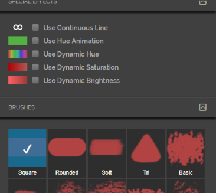
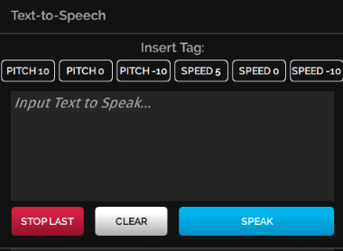

You can enhance your experience in High Fidelity by installing apps from the Marketplace. These apps enable you to get more out of High Fidelity. Do you want to record your avatar dancing, take selfies, or finger paint? Or are you looking to livestream to YouTube or make your avatar clap? Our Marketplace has a number of apps that can help you customize your experience in-world. If you can't find an app for what you'd like to do, you can [create your own](../../../create/applications) and upload it to our Marketplace for your personal use or to sell to others.

**On this Page:**

* [Install an App](#install-an-app)
* [Our Marketplace Apps](#our-marketplace-apps)
  * [Spectator Cam: Record or Livestream in High Fidelity](#spectator-cam)
  * [Finger Painting](#finger-painting)
  * [Text to Speech](#text-to-speech)

## Install an App

We and many users have created apps that are available in High Fidelity's Marketplace. To find and install an app:

1. In Interface, pull up your HUD or Tablet and go to **Market**.
2. Search for a specific app, or browse all apps by selecting the "Apps, Scripts, & Tools" category.
3. Click the app of your choice to purchase it and hit **Get** (for free items) or **Buy** (for purchased apps). Once you've purchased your app, you can view it in your **Inventory** or **Recent Activity**. 
4. After completing your purchase, click **Install App** to start using the app in High Fidelity.
5. Once the app is installed, click **Open App** to launch. You can also access the app through your HUD or Tablet.

## Our Marketplace Apps

We've listed some of the apps we created and how you can use them. 

### Spectator Cam

The Spectator Camera is a camera you can use, along with recording software such as [Open Broadcaster Software (OBS)](https://obsproject.com/), to record or livestream what you and your friends do in High Fidelity. 

>>>>> You can use the Spectator Camera only while using an HMD.

You can record or livestream what you see through your Spectator Camera using OBS. Check out their [official overview guide](https://obsproject.com/forum/threads/official-overview-guide.402/) for more details.

#### Get the Spectator Camera

[Use the instructions above](#install-an-app) to install the Spectator Camera app.

>>> While using the Spectator Camera, Interface's framerate might be affected. This is because Interface is rendering not only what you see, but what the Spectator Camera sees as well. 

#### Use the Spectator Camera

1. In Interface, pull up your HUD or Tablet and go to **Spectator**. 
2. Turn on your Spectator Cam by moving the slider. You'll see the camera appear in-world. By default, the app's display shows you what you see in VR through your HMD. This is to show you what you're recording without having to take off your HMD. 
3. To record yourself, you can switch your display from your HMD's view to the camera view. For example, if you want to record your avatar dancing, or trying on different wearables, you can use the camera view of your Spectator Cam. 
4. Enable switching views with your controllers in the **Spectator** app on your HUD or Tablet. 
   1. Rift: If you're using Oculus Touch controllers, click the left thumbstick to switch views. 
   2. Vive: If you're using HTC Vive controllers, press on the center of the thumb pad to switch views. 

### Finger Painting 

You can use the Fingerpaint app to paint your environment, your own avatar, or even another user's avatar. 

#### Get the Fingerpaint App

[Use the instructions above](#install-an-app) to install the Fingerpaint app.

#### Use the Fingerpaint App

1. In Interface, pull up your HUD or Tablet and go to **Body Paint**. 
2. First, click **Options** to select what you would like to paint on - the world around you, your avatar, or another user's avatar (with their permission).  
3. Click **Palette** to select a color for your paint. 
4. Click **Brushes** to select the settings for your brush, such as stroke width, type of brush, and special effets.

### Text to Speech

The Text to Speech app synthesizes the text you type into speech. You can use this app if you don't wish to use your voice, have microphone issues, or have disabilities. 

#### Get the Text to Speech App

[Use the instructions above](#install-an-app) to install the Text to Speech app.
>>>>> Currently, the Text to Speech app only works on Windows, since it relies on Microsoft's Text-to-Speech API built on Windows.

#### Use the Text to Speech App

1. In Interface, pull up your HUD or Tablet and go to **TTS**. 
2. In the app, select the Pitch and Speed of your choice. 
3. Type in the text you'd like your avatar to speak.
4. Hit **Speak** to hear your text. Hit **Stop Last** to stop your avatar from speaking.
. 