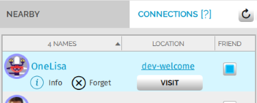
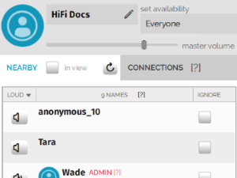
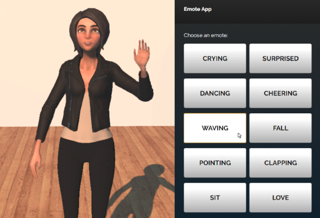
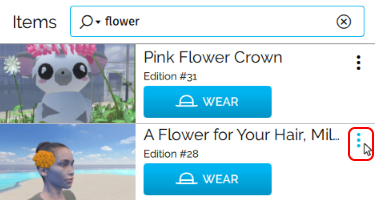
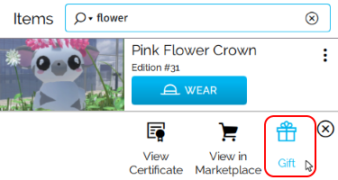

High Fidelity is all about the people you meet and the experiences you have with them. High Fidelity enables people connected by interest, community, and friendship to come together from anywhere in the world.

**On This Page:**
* [Make Connections and Friends](#make-connections-and-friends)
* [Attend Live Events](#attend-live-events)
* [Express Yourself](#express-yourself)
* [Giving and Receiving Gifts](#giving-and-receiving-gifts)

## Make Connections and Friends

In High Fidelity, you can establish a connection with someone else by shaking hands with them. With your hand controllers, place your hands near each other and hold the grip button. Desktop users can press and hold <kbd class="keyboard">X</kbd> on their keyboard. 

Once you make a connection with someone, they will appear under Connections in the [People App](#the-people-app). You will also appear on their list of connections. You will be able to see where they are in the metaverse, and you can travel to them at any time. 

To mark a connection as a friend, check the box next to their name in the People App. 

### The People App

The People App provides a set of tools that help users manage their interactions with people in the metaverse. It gives you a list of the people nearby (in the same domain as you), and gives you easy access to all of your connections. From the People App, you can: 

* Change your availability
* Toggle your visibility between friends, connections, and the entire community
* Set the master volume for the domain you're in
* Teleport directly to a friend's location

### Your Privacy Bubble

You can enable a privacy bubble that protects your personal space in the metaverse. When it is enabled, other people will disappear if they get too close to you. Your privacy bubble is disabled by default. To enable it, pull up your tablet or HUD and click Bubble.

## Attend Live Events

One of the great things about virtual reality is that you can attend events. High Fidelity regularly hosts events such as workshops, lectures on VR, and town hall meetings to meet our team. Click here to [view all upcoming events](https://tockify.com/hifieventscalendar/agenda), Events are a great place to meet others and share experiences with others around the world.

To attend an event, simply go to the hosted domain at the time of the event.

## Express Yourself

There are many ways you can express yourself in High Fidelity, such as animating the mouth of your avatar or using gestures in the Emote App. 

By default, all avatars will use a standard set of animations, such as your eyes blinking or your mouth opening and closing as you talk. When you are using a VR controller, your avatar will automatically mimic your hand gestures and movements. 

### The Emote App

The Emote App is a way for desktop users to express themselves without using VR controllers. With this app, you can display feelings by: crying, acting surprised, dancing, cheering, waving, falling, pointing, clapping, sitting, or showing love. 

## Giving and Receiving Gifts

Just like in real life, you can give money or presents to your friends in High Fidelity. You may wish to send someone HFC for a service or give a birthday gift to a friend. 

### Giving HFC to Others

To send money to a connection or someone nearby:
1. In Interface, pull up your tablet or HUD and go to Inventory.
2. In the Inventory app, click "Send Money". 
3. Send money to one of your connections or even someone nearby in the same domain. 
	* If you want to send it to one of your connections, click "Connections" and choose the recepient from the list.
	* If you want to send it to someone nearby, click "Someone Nearby" and choose your recepient by triggering or clicking on someone nearby to select them. 

### Gifting Purchased Items to Others

After you buy something from the Marketplace, you can give it to a connection or someone nearby. To do so: 
1. In Interface, pull up your tablet or HUD and go to Inventory.
2. In the Inventory app, click "Items". 
3. Scroll to the item you'd like to give and click on the menu. 
4. Select 'Gift'. 
3. Send the item to one of your connections or even someone nearby in the same domain. 
	* If you want to send it to one of your connections, click "Connections" and choose the recepient from the list.
	* If you want to send it to someone nearby, click "Someone Nearby" and choose your recepient by triggering or clicking on someone nearby to select them. 
