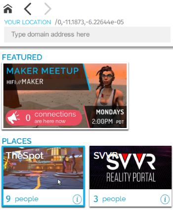

High Fidelity is made up of many virtual places that let you participate in activities and interact with the people around you. Many of thsee places are beautifully detailed worlds that are interesting to explore at any time, while others were built to host events and engage with the people around you.

* [GOTO App](#goto-app)
* [Visit a Friend](#visit-a-friend)
* [Movement Controls - Mouse and Keyboard](#mouse-and-keyboard)
* [Movement Controls - VR Controllers](#vr-controllers)
* [Movement Controls - Gamepad](#gamepad)

## GOTO App
The GOTO app lets you travel between different places in the High Fidelity metaverse. Many of our places are created by users just like you. 

To go and explore new places: 
1. In Interface, pull up your tablet or HUD and go to GoTo.
2. If you know where you want to go, enter the domain address or place name. As you type, the matching places will show up. Otherwise, browse the open places under "Featured" and "Places".
3. Click on a place name to go to the place. If you have permissions, you will be transported to that location automatically. 

The GOTO app also shows you a visual feed of snapshots that people have taken and shared in the metaverse. Clicking on a snap will take you directly to the place where the picture was taken. 

## Visit a Friend
Once you've made a friend, you can see where they are and even teleport directly to them. 

1. In Interface, open your tablet or HUD and go to People. 
2. Click Connections and find the friend you want to visit. 
3. Select their name then Visit.

## Movement Controls
This guide will help you move around in the metaverse.

### Mouse and Keyboard

| Movement  | Key | 
| ------------- | ------------- |
| Walk Forward | <kbd class="keyboard">W</kbd> or <kbd class="keyboard">Up Arrow</kbd>  |
| Walk Backward  | <kbd class="keyboard">S</kbd> or <kbd class="keyboard">Down Arrow</kbd>  |
| Side Step to the Left | <kbd class="keyboard">Q</kbd> or Right Click + <kbd class="keyboard">A</kbd>   |
| Side Step to the Right  | <kbd class="keyboard">E</kbd> or Right Click + <kbd class="keyboard">D</kbd>   |
| Turn Left | <kbd class="keyboard">A</kbd> or <kbd class="keyboard">Left Arrow</kbd>   |
| Turn Right | <kbd class="keyboard">D</kbd> or <kbd class="keyboard">Right Arrow</kbd>   |
| Jump | <kbd class="keyboard">space</kbd> |
| Fly | Hold <kbd class="keyboard">space</kbd> | 
| Fly Down | <kbd class="keyboard">C</kbd> |  
 

### VR Controllers

>>>>>If you want to jump and fly in VR, you must enable it under Settings > Controls > VR Movement.

### Gamepad

While the use of a gamepad is supported, High Fidelity is best experienced with hand controllers like the Oculus Touch, HTC Vive, and Microsoft MR controllers.

