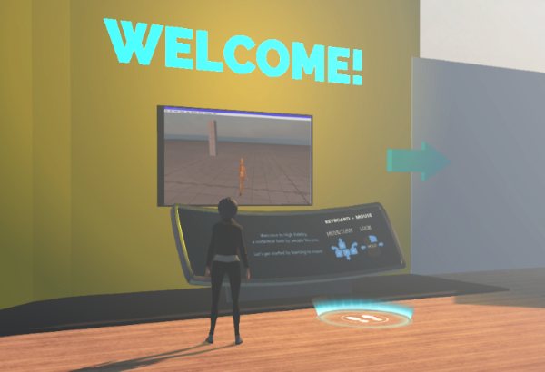

High Fidelity is a metaverse where you can connect and create with others. We invite you to explore VR worlds created in High Fidelity and interact with other users. You can visit your friend's VR world, meet people, attend events and even go for a class on avatar creation. It's an immersive and interactive experience with realistic visuals and audio.

When you first launch High Fidelity Interface, you'll start your High Fidelity journey in a tutorial that will walk you through the basic controls in High Fidelity. 

Throughout this chapter, learn how to make the most of your exploration: 

* [Install High Fidelity](./installation)
* [Personalize your experience](./personalize-experience)
* [Change your avatar](./personalize-experience/change-avatar)
* [Move and Travel between worlds](./travel)
* [Interact with other people](./interact-with-others)
* [Bank and shop](./bank-and-shop)
