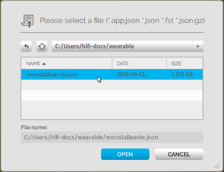

To build and create things in High Fidelity, you need to become familiar with the tools available to you. We've created our own custom tools (Create app and Shapes app). In addition, you can use many external tools to fine-tune your creations. These tools can help you create anything from a cool avatar or a baseball hat, to a magic themed domain.

**On this page:**
+ [Create App](#create-app)
+ [Shapes: Create in VR](#shapes-create-in-vr)
+ [Marketplace Item Tester](#marketplace-item-tester)
+ [External Creator Tools](#avatar-creator-tools)
  + [Adobe Fuse](#adobe-fuse)
  + [Mixamo](#mixamo)
  + [Blender](#blender)
  + [Maya](#maya)
  + [Blocks](#blocks)

## Create App

Use the **Create** app to [create any type of entity](../entities/create-entities). In Interface, pull up your HUD or Tablet and go to **Create** to get started. The Create app lets you:

+ Add Entities: You can [add any type of entity](../entities/create-entities) using the Create app. You can also import externally created models and materials using the Create app. 
+ Edit Entity Properties: An entity's [appearance](../entities/entity-appearance), [position](../entities/entity-appearance#move-an-entity), and [behavior](../entities/entity-behavior) are controlled by its properties. You can edit these properties through the Create app. 
+ Expose a Grid: The **Grid** tab in the Create app is used to expose a grid to assist you with the layout. Use this to toggle grid visibility, toggle snapping to the grid, and set the grid position, size, and color.
+ Display the Entity List: When you open the Create app, the Entity List pops up. This window lists all the entities in the domain. 

### Entity List

The Entity List shows you all entities in the local domain. You can filter by entity type and by distance from the current location. 

When you select an entity in the Entity List, you can
+ Find an entity: You can double-click an entity on the list to view it in your domain. You will see the entity with a bounding box and arrows around it. 
+ Lock an entity: A locked entity cannot be edited. Select an entity and click the lock icon on the top of the window.  
+ Change visibility: You can hide or make an entity visible. Select an entity and click the eye icon on the top of the window.
+ Name an entity: Name an entity when you select it on the list.
+ Delete an entity: Delete an entity by clicking on the red bin icon on the top-right corner of the window. 

## Shapes: Create in VR

The Shapes app is a Marketplace app that lets you add and edit basic shapes (entities) in High Fidelity. You can use Shapes only in VR mode. 

To get the Shapes app: 
1. In Interface, pull up your HUD or Tablet and go to **Market**. 
2. Search for **Shapes** and hit Get to get it for free. 
3. Install the app. 

### Use the Shapes app
1. In Interface, pull up your HUD or Tablet and go to **Shapes**.
2. A Tools menu and Create palette will be attached to your non-dominant hand. You can set your dominant hand by going to **Settings > Avatar > Dominant Hand**. 
3. In the Create palette, click on one of the shapes to create and add that entity. 
4. The entity will be created at your hand. You can grab it by pressing the trigger on your controller. 
5. In the Tools Menu, you can edit an entity's properties. Activate a tool by clicking its button. You'll see an icon representing the tool you selected on your dominant hand. You can deactivate a tool by hovering over the title bar and clicking "Back".
   1. Color: You can choose a color for your entity by pointing your laser at "Color" in the Tools menu and dipping your finger or stylus in the color of your choice. You can even create color swatches for yourself. 
   2. Stretch: You can change the dimensions of your entity by stretching it. Select "Stretch" to see the handles on your entity that you can pull it using your controllers. 
   3. Clone: You can clone your entity using the "Clone" tool. Select "Clone", point your laser at your entity and pull out its clone. 
   4. Group: You can group two or more entities together for easier editing. Select "Group" and then select all the entities you want to group. 
   5. Physics: You can modify the physics (behavior of your entity in space) using the "Physics" tool. Select "Physics" to see the variety of options available to you. 
   6. Delete: You can delete an entity by selecting "Delete" and then selecting the entity you want to delete. 

## Marketplace Item Tester
Once you have created an item, you can test it prior to using it or [submitting it to Marketplace](../../sell/add-item). The Marketplace Item Tester reviews all kinds of content, including applications, avatars, content sets, entities, and wearables. Using it, you can verify that your item works the way you expected, and does not have any script errors.

To use the Marketplace Item Tester:
1. In Interface, open the Developer menu and go to **Marketplace Item Tester**.
2. You can load items in two different ways:
    - Click "Load File" to load an item from your local computer or network. Browse to your file to open it. 
    - Click "Load URL" to load an item hosted in the cloud. 
3. Next to the item you loaded, you will see an icon indicating the type of content. If it is incorrect (or we fail to identify it), you can change it using the dropdown list.
    
 Application

    
 Avatar

    
 Content Set

    
 Entity

    
 Wearable

4. Click the icon to load your content in world. 

## External Creator Tools

We've listed some external tools you might want to use to create avatars and 3D models. 

### Adobe Fuse
>>>>>There are community reports where users are unable to easily open Adobe Fuse once installed. To work around this issue, open it multiple times successively until you are able to open the application.

Use [Adobe Fuse]((https://www.adobe.com/in/products/fuse.html)) to create a custom avatar. The default heads, torsos, arms, and legs in Adobe Fuse can help you start your customization.

### Mixamo

[Mixamo]((https://www.mixamo.com/#/)) is a rigging system that will rig your avatar's skeleton for you. You do not need any advanced knowledge of rigging to create simple animations for your avatar. 

### Blender

[Blender](https://www.blender.org/) is an open-source 3D modelling creation suite which supports everything from modelling and rigging, to animation and simulation. You can also use Blender to fine tune your avatar, and ensure that the materials and textures render correctly in High Fidelity. 

###  Maya

[Maya](https://www.autodesk.in/products/maya/overview) is a subscription based 3D modelling toolset that you can use to create 3D models to import into High Fidelity. 

### Blocks

[Blocks](https://vr.google.com/blocks/) is a 3D modelling tool you can use in VR. Blocks lets you create models easily regardless of your experience. You can create something on [Blocks through Steam](http://store.steampowered.com/app/533970/Blocks_by_Google/) or download it for the VR equipment you are using.

