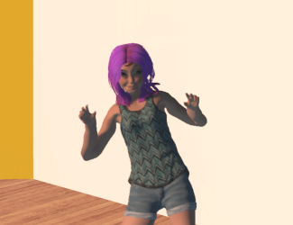

The steps involved in creating your avatar are:

1. Create an avatar with 3D character modeling tool such as Adobe Fuse. 
2. Rig and animate your avatar with an animation tool such as Mixamo.
3. Fine tune your avatar using a tool such as Blender or Maya.
4. Package the model in High Fidelity for use as an avatar.

Many of our community members have created basic skeletons and avatars that you can use as a starting point. If you use one of these, you can skip one or more of the steps above. 

**On This Page:**
* [Glossary](#glossary)
* [Community Tools for Avatars](#community-tools-for-avatars)
* [How to Package Your Avatar](#how-to-package-your-avatar)
* [YouTube Tutorial: Create Your Avatar](#youtube-tutorial)

## Glossary

As we delve deeper into creating custom avatars, we may use terminology that you are unfamiliar with. Here are some terms you might come across:

* Avatar - A virtual representation of a person or NPC.
* Mesh - The collection of 3D vertices and triangles for the avatar model. Without this, the avatar is invisible.
* Bones - A component of a skeleton that defines a "limb" such as an arm, leg, etc. Each bone may be animated as a separate limb in your avatar.
* Skeleton - A hierarchy of joints.
* Rigging - The process of creating a skeleton of the avatar model.
* Blendshapes - Variations of the topology that defines how the mesh is modified to create various "shapes".
* FST file - The main avatar file, which contains information about the skeleton, blendshapes, FBX file and textures used by an avatar.

## Community Tools for Avatars
As you're creating your avatar, remember that High Fidelity is an open-source project. Many of our community members have created plug-ins, add-ons, toolkits, skeletons and more to help you create content, including avatars. Here are a few for you to play around with.

### [Blender Add-on by Menithal](https://github.com/Menithal/Blender-Hifi-Addon)

Plugin ("Project Hermes") is a plugin for Blender to allow for easier content creation and importing for the High Fidelity Metaverse Platform. It features: 

- **Material Tools**: Allows for easier pipeline to apply materials to objects so that they are ready to use in High Fidelity.
- **Armature Tools**: Adds a skeleton that is compatible with High Fidelity and let you configure bone names for use in advanced scripts.
- **Avatar Converters**: Translates and fixes models and materials from MMD and Mixamo so that they work in High Fidelity.
- **Export Tools**: Exports avatars and scenes so that they can be used in High Fidelity.
- **Import Tools**: Imports primitive entities from High Fidelity so that you can make modifications to them.

Install it here: [https://github.com/Menithal/Blender-Hifi-Addon](https://github.com/Menithal/Blender-Hifi-Addon)

---
Have a project you've been working on that you'd like us to share? Let us know by editing this page in GitHub! 

## How to Package Your Avatar

No matter how you [created your custom avatar](../), you must convert your FBX model to FST before using that avatar in High Fidelity. This process is called *packaging your avatar*.

### Generate an FST File
High Fidelity provides a built-in tool that will create an FST file that will animate our avatar in VR. 

1. In Interface, go to Edit > Package Model as fst.
2. Click Browse and locate the FBX file for your avatar. Click OK. 
3. The Set Model Properties window lets you map the FBX properties with everything that High Fidelity needs to know to create your avatar. If you use Mixamo, these will be set automatically for you and you do not need to make any changes. Here, you can also attach external textures or scripts to your avatar. Click OK.
>>>>>Scripts let you produce special effects for your avatars. For more information, check out [Get Started with Scripting](https://docs.highfidelity.com/learn-with-us/get-started-with-scripting).
4. Browse to the folder where you want to save your avatar files. We recommend creating a new directory for each avatar. 

At this point, your avatar has been created! After hosting the avatar in the cloud or the Marketplace, [switch to it](../change-avatar#use-your-own-custom-avatar) and adopt your new look. 

## YouTube Tutorial

Check out this YouTube playlist for one way to create and customize your own avatar. Here, we use Adobe Fuse to create our avatar, Mixamo to rig our avatar automatically, and Blender to adjust the rendering on our avatar. We also have written instructions on the same process: 

* [Create an Avatar with Fuse](./fuse-tutorial)
* [Rig Your Avatar in Mixamo](./mixamo-tutorial)
* [Modify Materials and Textures with Blender](./blender-tutorial)

[plugin:youtube](https://www.youtube.com/watch?v=6NfiH4rdVRM)

