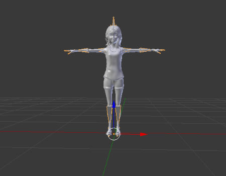
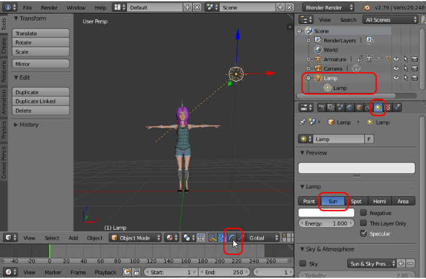
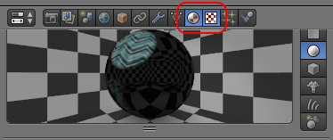
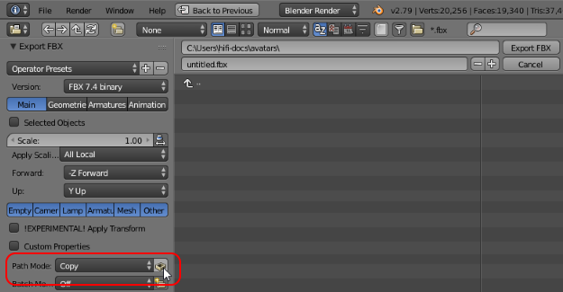
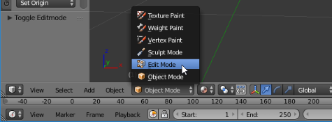
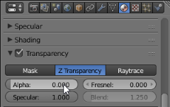
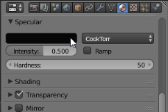
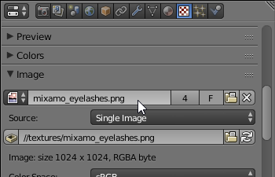

Blender is an open-source 3D modelling tool that you can use to fine tune your avatar and ensure that the materials and textures render correctly in High Fidelity. 

In this tutorial, we will walk you through simple modifications you can make to your avatar using Blender. You will need to import an FBX file for your avatar. If you don't have one, see our tutorials for [Fuse](../fuse-tutorial) and [Mixamo](../mixamo-tutorial).

1. In Blender, go to File > Import > FBX (.fbx). 
2. Choose your avatar's FBX file and click **Import FBX**. This will open your avatar in the main view. 
3. By default, you will not see the materials on your avatar. You can change your view using the toolbar at the bottom of the view. 
4. To get a better view of your avatar, change the lamp settings:
    - From the Outliner, click the Lamp node in Blender.
    - For "Type of Active Data to display and edit," choose the Data icon. 
    - Change the lamp to Sun.
    - Rotate the Lamp to light up your avatar.
5. From the Outliner, open the 'Armature' tree and select the item you want to fine tune. You can also click on the item directly on your model.
6. Using the toolbox below, you can change the materials and texture of each body part as desired. We've included an example below that [changes our avatar's eyelashes](#example-update-eyelashes-from-an-image). You can follow similar steps for other avatar items. 
>>>>>To remove a metallic feel to your avatar in High Fidelity, we recommend changing the default Specular Intensity for each of the main body parts from 0.500 to 0.000.
7. When you're done changing your materials and textures, go to File > Export > FBX (.fbx).
8. Change the Path Mode to **Copy**, then click the 'Embed Textures' icon. This makes sure that all of the textures are embedded into your model. 
9. Give your avatar a unique name. 
10. Click the Export FBX button.

Now, you are ready to bring your avatar into High Fidelity.

### Example: Update Eyelashes from an Image

1. Save [this texture](http://hifi-content.s3.amazonaws.com/DomainContent/Event%20/Images/mixamo_eyelashes.png) to a directory where you will remember.
2. From the Outliner, open the 'Armature' tree and select 'Eyelashes'.
3. In the Toolbox below, click the Materials icon. 
4. Click the + button next to the material list to create a new material slot.
5. Click **+ New** to add a new material.
6. Rename the new material to **lashes**.
7. At the bottom of the Blender window, switch to Edit Mode. 
8. Under the material list, click Assign.
9. Scroll to the ‘Transparency' section. Check the Transparency box and change the ‘Alpha' value to 0.00. 
10. Scroll to the 'Specular' section. Set the specular color to black. 
11. Change to the Textures view. 
12. Click **+ New** to add a new texture.
13. Scroll to the Image section. Click ‘Open' and find the lashes texture named ‘mixamo_eyelashes' you previously downloaded. Click Open Image. 
14. Check the 'Alpha' options in the following sections: Image, Preview, Texture, Influence
15. Go to File > External Data > Pack All Into .blend. This will include the texture in your model.

