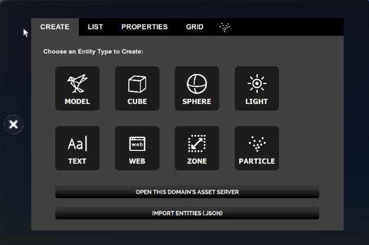
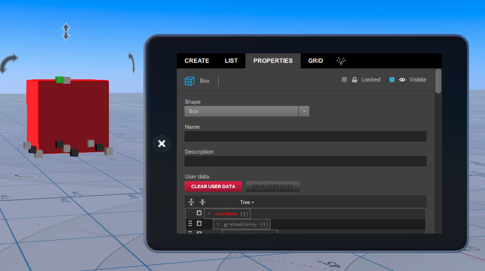

## Introduction

When you click the Create button on the tablet, you are ready to start adding, editing and deleting entities. The create button is controlled by a script called `edit.js`, which you can change to create a new kind of editor, or replace with a different one. `Edit.js` is one of the default scripts that run when you launch the Interface.

> > > > > You can only use the Create mode in domains where you have the permission to build. 

###Start Creating

Turn on Create mode by clicking the Create button on the tablet or HUD. 

In the toolbar or tablet, you should see a button labeled **create**.

To enable create mode, click the **create** button. You can use the mouse or your controller to add, edit and delete an entity. 

### Adding Entities Using the create Toolbar

When you click on the Create button, a window opens showing the different types of entities you can use. You can add an entity by clicking on the button for that entity. For instance, if you want to add a cube entity, click on cube. 

>>>>> Each entity type has its own set of properties that define the entities appearance and behavior. 

