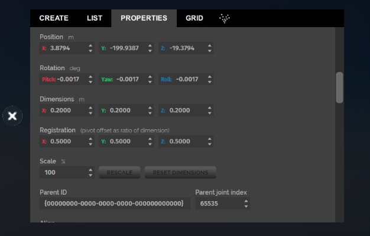
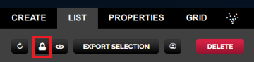
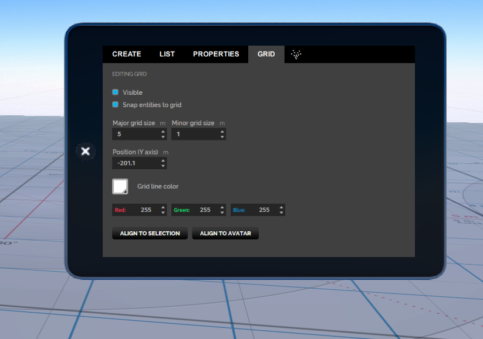

You can edit an entity's position, rotation, and scale using your mouse or trackpad. You can also duplicate and delete entities using the mouse and keyboard.

To edit an entity using the mouse or trackpad, you can select the entity or find it in the List tab in Create mode. 

>>>>>By default, Light entities and Zone entities cannot be selected for editing. To be able to select Light entities, go to **Settings > Advanced Menus**, and then select **Edit Menu > Allow Selecting of Lights**. To select Zone entities, you must click on the Zone entity in the List tab.

You can tell an entity is selected when you see the bounding box and arrows around it. These arrows are the rotate and stretch widgets.

With the entity selected, you can:

- Change the entity's position.
- Change the entity's scale.
- Change the entity's rotation.
- Duplicate the entity.
- Delete the entity.

>>>>> When in create mode your arrow keys move the camera instead of the avatar, you do not need to move the avatar to get a better look. 

#### Change the Entity's Position

Entities can be easily moved around using the mouse, but care must be taken not to accidentally click the *rotate widgets* or the *size widgets*.

- To move the entity across the ground plane, click the entity at a spot where there are no widgets highlighted and hold and drag the mouse.
- To move the entity up and down, use the double arrow at the top.

#### Change the Entity's Scale

Grabbing the black squares at the edges of the entity bounding box enables you to stretch and shrink the object.

- To resize the height only: Grab the little square widget at the top of the entity and drag up or down.
- To resize one side at a time: Grab one of the little square widgets at the bottom edges and drag in or out.
- To resize proportionally across the X and Z axes (ground plane): Grab the little square widgets at the bottom corners and drag in or out.
- To resize proportionally across all three axes: Hold the **Shift** key and grab the little square widgets at the corners and drag in or out.
- You can undo this action by pressing the **CTRL/Z **keys together.

#### Rotating the Entity with the Mouse

Grabbing any of the three curved arrows enables rotation about one axis.

- Grab one of the curved arrows to rotate on that axis.
- Move the mouse closer to the object to snap to whole sizes.
- Move the mouse further away to rotate as free wheel (no snapping).
- You can undo this action by pressing the **CTRL/Z **keys together.

#### Duplicating the Entity with the Mouse

To duplicate an entity:

1. Press and hold the **ALT** key and grab the entity with the mouse.
2. Drag to create a copy.

>>>>> The safest way of doing this is to hold the **ALT** key and grab the up/down arrows and duplicate up.

You can undo this action by pressing the **CTRL/Z** keys together.

#### Deleting an Entity

Press the **Backspace** key to delete the selected entity.

## Editing Entities Using the Create Panel

The *create* panel has three tabs: *Create*, *List*, and *Properties* and *Grid*. Theses tabs allow you to:

- List entities in the domain.
- Create entity properties: Entity properties define an entity's appearance (color, size, position etc.) and behavior (animation, collision, interaction, etc.).
- Expose a grid to assist in layout.

### List the Entities in the Domain

To list all of the entities on the domain, in the *create* panel, click the *List* tab and then click *Refresh* on the top-left corner of the panel. You can filter by entity type and by distance from the current location.

### Edit Entity Properties

Entity properties define an entity's appearance (color, size, position) and behavior (animation, collision, interaction) and much more. The entity type will define the specific set of properties the entity has.

To edit an entity's properties:

1. Select the entity. 
2. Go to **Create > Properties** on your tablet. 

You'll see the properties listed for the selected entity. You can make changes to any of the listed properties if the entity is not locked. If you can't change a property, check the List tab to determine if the entity has been locked.

### Expose a Grid to Assist in Layout

The *Grid* panel is used to expose a grid to assist you with the layout. Using this panel, you can toggle grid visibility, toggle snapping to the grid, and set the grid position, size, and color.

