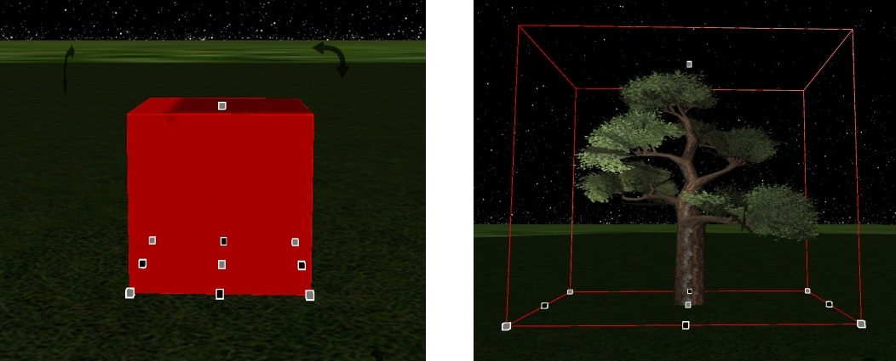

## Overview

When your avatar comes in contact with an entity, you can control its interactions with the entity using simple scripts. An *entity*  is simply a building block in the virtual world. With them, you can build items in the metaverse from simple boxes to complex animated objects such as butterflies or stereo equipment. 

The `Entities.enterEntity()` method triggers an action when an avatar comes into contact with the object. When the avatar leaves the bounds of the object, it triggers `Entities.leaveEntity()`.

## Avatar Interactions with Entities

An interaction between an avatar and an entity occurs when the avatar comes in contact with an entity's bounding box. The bounding box (or bounds) is the frame that is around the outside of the entity. In the case of a cube, the bounds are the exact size and shape as the entity. However, in the case of more complex objects, the bounds might be larger than the actual mesh model.  

`Entities.enterEntity()` occurs when the avatar contacts the bounding box, not the model itself. Similarly, `Entities.leaveEntity()` occurs when the avatar exits the bounding box.



## Example

The following example walks you through the process of creating a simple entity, and scripting an interaction between the entity and your avatar. When your avatar comes in contact with the box, the box will change color. When your avatar moves away, the box will return to its original color. 

To create a cube entity: 
1. In Interface, pull up your tablet or HUD and select Create. 
2. In the Create Tools, click Cube. 
This will add a cube in front of you. 

The following script changes the color of the cube as you approach (yellow) or leave (pink) its bounding box. Save it to a file called `interactions-example.js`.

```javascript
(function(){
    this.enterEntity = function(entityID) {
        Entities.editEntity(entityID, {
            color: { red: 255, green: 64, blue: 64 },
        });
    };
    this.leaveEntity = function(entityID) {
        Entities.editEntity(entityID, { 
            color: { red: 255, green: 190, blue: 20}
        });
    };
});
```

Next, we'll view the properties of the cube entity we created and add our scripts.

1. Click the cube to select it. 
2. In the Create Tools, click the Properties tab. 
3. Scroll down to Script.
4. Enter the path and file name to `interactions-example.js` that you created above. Press Enter. 

A full range of entity parameters are controllable with these functions, entities can be used as invisible sensors or expanded to cover an entire building with the functions running while you are inside, and stop when you walk out.