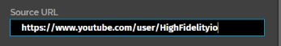
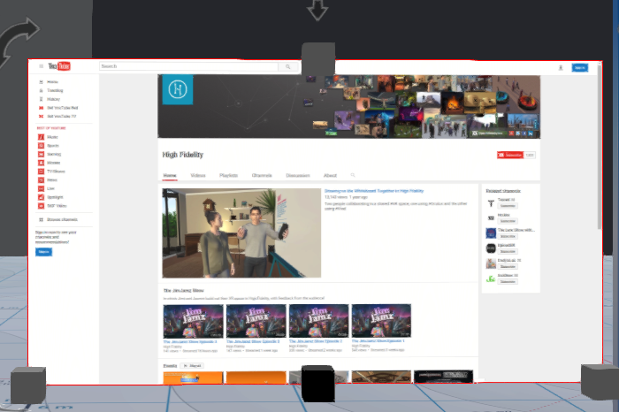

## Example: Create a Web Entity Displaying the High Fidelity YouTube Channel

To create a web entity that displays the High Fidelity YouTube channel, complete the following steps:

1. Go to **Create** and click on the web icon. A web entity should appear directly in front of you. This entity should display the High Fidelity home page.
2. Select the web entity and then select the **Properties** tab.
3. Scroll down until you see the Source URL option. Enter the High Fidelity YouTube channel URL: https://www.youtube.com/user/HighFidelityio
   
   You should see the new web page load soon as you press enter.
   
   ​Now, you can watch videos in-world and browse the internet.
