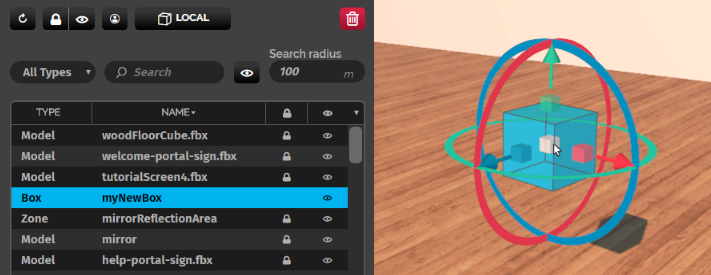
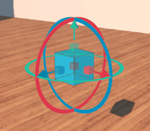
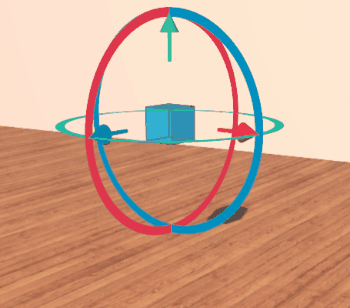

You can edit an entity's size, color, position and rotation using your mouse or trackpad. To edit an entity, open the Create app and either select the entity or find it in the Entity List. 

>>>>>By default, zone entities cannot be selected for editing. To select these entities, you must click on the entity in the Entity List of the Create App.

**On This Page:**
* [Change the Color of an Entity](#change-the-color-of-an-entity)
* [Set the Size of an Entity](#set-the-size-of-an-entity)
* [Rotate an Entity](#rotate-entity)
* [Move an Entity](#move-an-entity)

## Change the Color of an Entity

You can manually change the color of most entity types in the Create App. With the entity selected, click on Properties and scroll down to the Color settings. Here are the different color settings you can configure:

| Setting  | Description  | Supported Entity Type(s)  |
|---|---|---|
| Color  | The color of the entity  | Cube, Sphere  |
| Light Color  | The color of the light   | Light  |
| Text Color  | The color of the text   | Text  |
| Background Color  | The color of the background of the text   | Text  |
| Key Light  | The color of the lighting in the zone. Select Inherit to keep the lighting of the domain, or Off to remove all lighting   | Zone  |
| Sky Box  | The color of the ceiling in the zone. Select Inherit to keep the color of the domain, or Off to remove all color   | Zone  |
| Ambient Light | Configures the amount of ambient light in the zone. Ambient light reflects on content within your zone.    | Zone  |
| *Haze:* Haze Color  | When Haze is turned on, the color of the haze in the zone.   | Zone  |
| *Haze:* Glare Color  | When Haze is turned on, the color of the glare based on the key light.   | Zone  |
| Bloom | Configures how much the bright areas of the scene glow.    | Zone  |
| *Color:* Color  | As the particle moves, sets the color of the particle at the start, middle, and finish    | Particle  |
| *Color:* Color Spread  | The spread of color that each particle is given, resulting in a variety of colors    | Particle  |

## Set the Size of an Entity
For cube, sphere, text, image and web entities, you can change its size directly in your environment by selecting and dragging the small boxes inside the object. 

For all entities, you can also set the size manually in the Create App. With the entity selected, click on Properties and scroll down to the Size settings. Here are the different size settings you can configure:

| Setting  | Description  | Supported Entity Type(s)  |
|---|---|---|
| *Spatial:* Local Dimensions  | The size of the entity. If the entity is parented to an avatar, this value remains the original dimensions value while the avatar scale changes.   | All  |
| *Spatial:* Dimensions  | The size of the entity. If the entity is parented to an avatar, this value will change if the avatar scale changes  | All  |
| *Spatial:* Scale  | Sets the size of the entity as a percentage of its original size  | All  |
| Fall-Off Radius  | The distance from the light's center where the intensity is reduced  | Light  |
| Spotlight Cut-Off  | Affects the size of the spotlight's beam; the higher the value, the larger the beam  | Light  |
| Line Height  | The height of each line of text  | Text  |
| *Emit:* Dimensions  | The outer limit radius that particles can be emitted from  | Particle  |
| *Emit:* Radius Start  | The inner limit radius that particles can start emitting from  | Particle  |
| *Size:* Size  | The size of each individual particle in the entity  | Particle  |
| *Size:* Size Spread  | How far apart a particle is from other particles   | Particle  |

## Rotate an Entity

All entities can be rotated directly in your environment by selecting and dragging the circles around the object. 

You can also set the rotation manually in the Create App. With the entity selected, click on Properties and scroll down to the Rotation settings. Here are the different rotation settings you can configure:

| Setting  | Description  | Supported Entity Type(s)  |
|---|---|---|
| *Spatial:* Local Rotation  | The orientation of the entity relative to its parent   | All  |
| *Spatial:* Rotation  | The orientation of the entity with respect to world coordinates.  | All  |

## Move an Entity

All entities can be moved directly in your environment by selecting and dragging the object to the correct location. Alternatively, you can use the arrows around the object to move it in only one direction. 

You can also set the position manually in the Create App. With the entity selected, click on Properties and scroll down to the Position settings. Here are the different position settings you can configure:

| Setting  | Description  | Supported Entity Type(s)  |
|---|---|---|
| *Spatial:* Local Position  | The position of the entity relative to its parent   | All  |
| *Spatial:* Position  | The position of the entity with respect to world coordinates  | All  |

