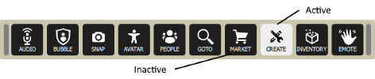

Applications (apps) in High Fidelity are customizable programs that expose functionality in an easy-to-use user interface. Apps let you take complex code from our API and simplify it into a window with controls for others to use. 

>>>>> To create custom apps, you must have a basic knowledge of web development (HTML, CSS and JavaScript) and be able to navigate our API. 

The steps involved in creating a custom app are:

1. Create icons to show up on the tablet and HUD.
2. Design your app's UI in HTML and CSS.
3. Create a JavaScript file that:
	* Adds a button to the tablet and HUD
	* Loads your app
	* Closes your app
	* Runs your code

## Tutorial: Create Gemstone Switching App
In this tutorial, we will walk through the above steps to create an app called "Gemstone Magic Maker". This simple app lets you spawn colorful little gemstones in VR that you can share with your friends.  

##### 1. Create icons to show up on the tablet and HUD
You need two icons to show up on the tablet and HUD: an SVG or PNG image to display on the app button when the app is active, usually named <appName>-a.svg and another to display when the app is inactive, usually named <appName>-i.svg

The recommended size for your icons are 50px by 50px (or square), white on a transparent background in the SVG file format. You can create your own icon using graphic design software or any other online resources. 

##### 2. Design your app's UI in HTML and CSS
Your app's UI You should provide text on how the app works, and use familiar UI elements that a user knows how to interact with (such as buttons, scroll bars, and links).