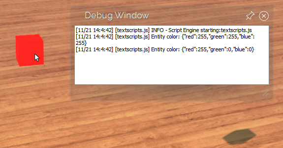

High Fidelity's robust [JavaScript API](../../api-reference) provides the tools for you to build great content and user experiences in VR. 

In this section, you can find simple code samples to do common tasks in High Fidelity. To see these code samples in action, copy the code to a file, `testScripts.js`, saved somewhere on your computer. 

**On This Page:**

* [Write to the Debug Window](#write-to-the-debug-window)
* [Create an Entity](#create-an-entity)
* [Edit an Entity](#edit-an-entity)

## Write to the Debug Window
In this example, we'll start with a simple "Hello, World" script. 

```javascript
print("Hello, World");
```

When you [load and run this script](../get-started-with-scripting#load-and-run-a-script), it will write the words "Hello, World" to the Debug Window in High Fidelity.


## Create an Entity
Instead of [using the Create app to add an entity](../../create/entities/create-entities), you can create one using a script. 

```javascript
// Get your position in the domain, so that the cube is spawned in front of you
var position = Vec3.sum(MyAvatar.position, Quat.getFront(MyAvatar.orientation));
var properties = {
    type: "Box",
    name: "ScriptBox",
    position: position,
    color: { red: 255, green: 0, blue: 0 }
};
var entityID = Entities.addEntity(properties);
print("Entity added");
```

When you [load and run this script](../get-started-with-scripting#load-and-run-a-script), it will locate your avatar in the domain, create a new entity based on the customized properties that you set, then print a line to the Debug Window. In this case, the entity will be a red box.  


## Edit an Entity
To manipulate an entity's properties, you can use `Entities.editEntity`. 

```javascript
var entityID = Entities.addEntity({
    type: "Box",
    position: Vec3.sum(MyAvatar.position, Quat.getFront(MyAvatar.orientation)),
});

var properties = Entities.getEntityProperties(entityID, ["color"]);
print("Entity color: " + JSON.stringify(properties.color));

Entities.editEntity(entityID, {
    color: { red: 255, green: 0, blue: 0 }
});
properties = Entities.getEntityProperties(entityID, ["color"]);
print("Entity color: " + JSON.stringify(properties.color));
```

When you [load and run this script](../get-started-with-scripting#load-and-run-a-script), it will locate your avatar in the domain, create a new entity based on the customized properties that you set, then print the color of that entity to the Debug Window. Then, the script changes the color of the entity to red, and prints the new color in the Debug Window.



**See Also**

+ [Load and Run A Script](../get-started-with-scripting#load-and-run-a-script)