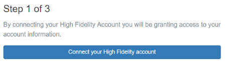
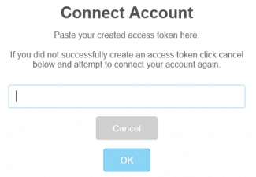
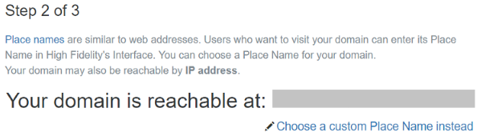
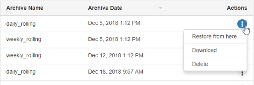

While you can use the sandbox as is, we recommend that you configure your domain settings to ensure that it is secure and serves your needs. 

**On This Page:**

+ [Configure Basic Server Settings](#configure-basic-server-settings)
+ [Add a Description For Your Domain](#add-a-description-for-your-domain)
+ [Change Your Content Settings](#change-your-content-settings)
  + [Manage Your Content Archives](#manage-your-content-archives)
  + [Upload Content](#upload-content)
  + [Set an Entry Path for Users](#set-an-entry-path-for-users)
  + [Add Scripts to Your Domain](#add-scripts-to-your-domain)
  + [Edit the Audio Enviroment](#edit-the-audio-environment)

    

## Configure Basic Server Settings

You can configure your domain's basic server settings to control how your domain is accessed and the permissions granted to different types of users. 

1. Right-click the High Fidelity icon on your system tray (Windows) or top menu bar (OS X). Select 'Settings'. If your domain is [hosted on a cloud service](../../host-your-domain), you can access your domain's server settings [here](https://highfidelity.com/user/cloud_domains). 
2. Your browser will open a page where you can start configuring your basic server settings. Click 'Skip Wizard' in the top right corner if you do not want to go through the setup wizard. You can always change your server settings later. 
3. In Step 1, you can connect your domain to your High Fidelity account. If you don't want to connect to your account right now, click 'Skip' and proceed to the next step. Otherwise, click 'Connect your High Fidelity account'. 
   1. Log in to High Fidelity in the tab that opens. 
   2. Click 'Create Token'. 
   3. Copy your new token.
   4. In the pop-up window on the settings page, paste the token and click 'OK' to connect your account. 
4. In Step 2, you can change your domain's place name. A domain's place name is similar to a website's URL. A user can use the place name to access your domain. High Fidelity generates unique place names for all domains. You can use this generated place name or [choose a custom place name](../../add-place-name). Just like a website's URL, you will need to purchase any custom place name you create. 
5. In Step 3, you can control user permissions. Add your username or any other username you wish to grant administrator privileges. You can also grant users basic permissions such as the ability to connect to your domain and create or rez content. You can also [secure your domain](../secure-domain) later. 
6. Click 'Finish'. You will be redirected to the Domain Settings page. 

In the domain settings page, under the Metaverse/Networking section, you can disconnect your High Fidelity account at any time. You can also click 'Advanced Settings' to view your access token, create a new domain ID, change your UDP port, and Enable Packet Verification. 

>>>>> If you modify your settings, you'll need to save and restart for the new settings to be reflected. You can do this by clicking 'Save' and then restarting your server by clicking 'Restart' once you're done with your modifications. This saves your settings and restarts your domain server.

## Add a Description For Your Domain

1. Under the Description section, click 'Advanced Settings' and add the following:
   1. Description: A description of your domain in less than 256 characters.
   2. Maturity: A maturity rating for your domain. You can choose **Everyone**, **Teen(13+)**, **Mature(17+)**, and **Adult(18+)**.
   3. Hosts: Add users who have permission to show your domain to other users. 
   4. Tags: Common categories under which your domain falls.

## Change Your Content Settings

Your domain's content settings can be changed to suit your requirements. You can use these settings to [backup and restore your domain](../../backup-restore-domain), run scripts when your domain loads, or add audio effects. 

1. Click on the 'Content' submenu in the server settings top bar to:
   1. [Manage Your Content Archives](#manage-your-content-archives)
   2. [Upload Content](#upload-content)
   3. [Set an Entry Path for User](#set-an-entry-path-for-users)
   4. [Add Scripts to Your Domain](#add-scripts-to-your-domain)
   5. [Edit the Audio Enviroment](#edit-the-audio-environment)

### Manage Your Content Archives

Your domain server makes regular archives of the content in your domain. These archives include all the entities in your domain. You can also modify the 'Automatic Content Archives' settings by going to **Settings > Automatic Content Archives**. You can upload and download content archives onto your computer and use these files to restore your domain.  

The 'Content Archives' section can be used to restore your domain to a previous version or to share your archive and settings with another user. In this section you can:

- **Restore, Download, or Delete an Archive**: On any archive of your choice, click 'Actions' on the right to:
  - **Restore from here**: Reset the domain to that saved state or archive.
  - **Download**: Compress all of the content in your domain to a downloaded zip file.
  - **Delete**: Remove the archive from the saved archives list.  
- **Generate New Archive**: You can create a content archive manually by clicking 'Generate New Archive'. 

### Upload Content

You can upload any content archive file to your domain. This can be a file received from another user or an archive of your own domain. 

1. Choose your archive zip file from your computer. 
2. Select 'Upload Content' to upload a content archive.

### Set an Entry Path for Users

You can control where users appear and what direction they face when they visit your domain. To set this path for your domain:

1. In your domain, move your avatar to the point where you wish to have users appear. 
2. Go to **Navigate > Copy Path to Clipboard**. The path will be represented using 3D coordinates with orientation information, for example `/-8.10251e-07,-11.1818,1.79641e-05/0,-0.708837,0,0.705372`. This type of path is tedious to approximate and enter manually, making 'Copy Path to Clipboard' the more practical method of defining a path.
3. Open your [domain settings](https://highfidelity.com/user/cloud_domains) if you're hosting it on a cloud service. Or, use (http://localhost:40100/settings/) for a local sandbox. Click 'Content' and go to 'Paths' on the drop-down menu. 
4. Click the plus sign to add a new path. Paste your copied path under 'Viewpoint'.

You can add multiple user directions and rotations using this table. Exactly like a website URL, if a user is going to `example-domain` and enters it by typing in `example-domain/taco`, they will appear with the direction and rotation of the `/taco` path.

### Add Scripts to Your Domain

You can add scripts that always run on your domain. These are called [persistent scripts and run on the assignment client](../../../script/assignment-client-scripts). These scripts will continue to run until your domain is shut down. 

1. In your domain settings, go to **Content > Scripts** and add its URL to the 'Persistent Scripts' table.

>>>>>Scripts are cached. If the content on the URL host changes, you may want to use some cache-defeating trick, such as specifying a URL with query parameter such as http://whatever.com/path/file.js?version=17*

### Edit the Audio Environment

The audio settings affect how sound is transmitted and received throughout your domain. You can modify the following audio settings to bring about the desired effect:   

  - **Attenuation**: This determines how much quieter sounds get over a distance.
    - The default domain attenuation is the amount of noise reduction that is enabled across the domain environment. High Fidelity domains default to a distance attenuation curve roughly like the real world. If you see two avatars talking in the distance, you can hear them, but not very well. If you approach them, they become more audible in a manner that approximates what you're likely to be used to. If the default attenuation is `0`, no matter how far away a sound source is, it still plays at full volume. Likewise, the default attenuation for a domain can be set very high (to a max value of 1), making only things very near to you audible.
  - **Zones**: By setting a zone, you can specify axis aligned, 3D boundaries for audio environments that aren't applied to the whole domain.
    - **Attenuation coefficients**: These determine how sound is transmitted between zones. When the attenuation coefficient is `0`, there is no volume attenuation with someone in another zone; at `1`, you won't be able to hear someone in another zone.
  - **Reverb Settings**: These settings enable echo-like effects in your domain. It can give the effect of sounding like you are in a large empty room, deep inside a large cave, or inside a tiny room like a tiled shower.
    - **Zone**: This is the zone that you defined earlier in the table.
    - **Reverb Decay Time**: How long you can hear an echo after the initial sound.
    - **Wet/Dry Mix**: The percentage mix of the reverb tail relative to the original "dry" signal. Levels between 5-25% will generally give you useful results. For a very thick reverb, you might try a value as high as 50% where the reverb is nearly as loud as the original signal.

#### Example: Building a Stage

You can add audio settings for a stage in your domain. This stage is used for performances and events. 

1. Create two new zones, call them "Stage" and "Audience".
2. Set the 'Attenuation Coefficients' to zero with Stage as the source and Audience as the listener. That way, anyone in Audience will hear anyone on Stage at maximum volume. 
3. If you want to minimize people in the audience hearing one another in the Audience zone, set up another 'Attenuation Coefficients' pair with Audience as both source and listener, and set the distance attenuation very high--e.g., to 1.0. That way, you'll only hear people very close to you like your friend on your right, but won't hear the guy coughing 10 rows back.

**See Also**

+ [Secure Your Domain](../your-domain/secure-domain)
+ [Broadcast Your Domain](../../broadcast-your-domain)
+ [Restore Your Domain](../../backup-restore-domain)