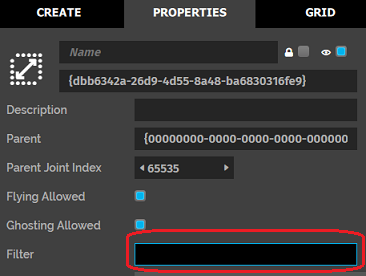

You can control your domain's server settings to protect it from being modified by other users. By setting the right permissions and filters, you can ensure that your domain is secure.

**On This Page:**

+ [Edit Domain Security](#edit-domain-security)
+ [Adjust Your Domain Server Settings](#adjust-your-domain-server-settings)
+ [Edit Entity Properties](#edit-entity-properties)
+ [Add Entity Filters](#add-entity-filters)

## Edit Domain Security

To have a basic level of security for your domain settings:

1.  Open your [domain's server settings](http://localhost:40100/settings/). 
2. In the Security section, put in your username in **HTTP Username** and any password in **HTTP Password** field.

Every time, you or any user tries to access your server settings, you'll be prompted to enter your username and password.

### Maximum User Capacity

You can limit the number of users connected at a time to your domain using the Maximum User Capacity field. 

If you set this to 0, it means there is no limit to the maximum number of users who can connect to your domain at one time. If you set this to 1, it means only one user will be able to visit your domain at one time. Avatars connected to the same local machine are not restricted by this limit.

## Adjust Your Domain Server Settings

Edit the permissions you have granted to users to ensure that no one can modify your domain without your consent. 

1. Open your [domain's server settings](http://localhost:40100/settings/). 

2. Update the standard permissions to specify who can come in and change your domain. There are different types of users and permissions. 

| User Type | Description                                                  |
| --------- | ------------------------------------------------------------ |
| Anonymous | A person who is not logged in and is using an instance of High Fidelity's Interface. This is the default user type for someone who has downloaded Interface for the first time. |
| Friends   | A user that you have connected with by shaking hands with their avatar and clicking on the 'Friends' checkbox in your **People** app. Connections are different from Friends. By default, Friends have more permissions in your domains than your Connections. Connections are treated like anonymous users. |
| Localhost | A user who is running Interface on the same machine where the server is hosted. Localhost users do not need to be logged in and have permissions that override non-user-specific permissions. |
| Logged In | A user that is logged into their High Fidelity account while using Interface. They do not need to be a Friend or a Connection to have server rights. Permissions that are granted to a specific user override all other permissions |

| Permissions | Definition |
| ----------- | ---------- |
| Connect |  A user is allowed to enter your domain. |
| Lock/Unlock |  A user can lock entities to prevent them from being moved/modified. They can also unlock entities to enable edits. |
| Rez |  A user can create (or rez) entities for an unlimited amount of time. They will also have full access to the Create menu.|
| Rez Temporary | A user can temporarily rez entities that have a default lifetime of 1 hour. They will still have full access to the Create app.|
| Rez Certified | A user can rez pre-approved and entities and scripts from the Marketplace for an unlimited amount of time. |
| Rez Temporary Certified | A user can rez pre-approved entities or scripts from the Marketplace with a set lifetime that also defaults to 1 hour. |
| Write Assets | A user can add assets (models, audio, or other files) to your asset server (your domain's file storage space). |
| Ignore Max Capacity |  A user can enter a domain even when it has hit the specified capacity limit. |
| Kick Users |  A user is allowed to remove other users from a domain. |
| Replace Conten | A user can change the entire content set of a domain|

  

3. You can also grant permissions to specific users under the 'Permissions for Specific Users' table by adding their usernames.

4. Groups and lists can be made through the [groups registration page](https://highfidelity.com/user/groups)
    - A **group** is a collection of people that voluntarily join.
    - A **list** is a collection of people to which a user is added automatically.
    - Granting/taking away permissions to a group or list will copy those permission rights to the users in the group even if you are not friends with them.

5. To save your domain settings, click on the “Download Domain Settings” button, which will save your settings to a JSON file. You can upload these later using the “Upload Domain Settings” button
    

## Edit Entity Properties
You can edit entity properties in your domain to lock them from being edited. 
1. In Interface, pull up your HUD or Tablet and go to **Create**.
2. Add a box entity by clicking on the 'Cube icon'. 
3. Switch to the “List” submenu to search for your newly created entity using the filter bar.
4. You can disable editing, deleting, or moving the entity for everyone by choosing the lock icon from this menu or the “Properties” submenu. 
5. Unlock it to re-enable editing


## Add Entity Filters

>>>>> Anyone with connect permissions can make edits to your domain if they are not locked. Using filters is the only way to prevent unwanted edits.

Entity filters are specialized javascript functions that allow you to prevent unwanted modifications to  entities in your domain. They can be applied to a whole server or to specific zones within a domain. 

Entity filters apply to all users who do not have lock/unlock permissions. You can use filters to request the original properties of an entity to compare them to new values. You can then approve the new values. 

### Set an entity filter on the whole domain:  


To protect all entities in a domain while granting edit rights, copy the URL to a JavaScript filter script that follows this template:

```
// prevent-all-deletes.js by Brad Hefta-Gaub
(function() {
	function filter() { 
		return false; // all deletes are blocked
	}
	filter.wantsToFilterAdd = false; // don't run on adds
	filter.wantsToFilterEdit = false; // don't run on edits
	filter.wantsToFilterPhysics = false; // don't run on physics
	filter.wantsToFilterDelete = true; // do run on deletes
	filter;
});

```

### Set an entity filter on a specific zone entity:  
Copy the script URL to the "Filter" script property in a zone's properties:  

To protect specific entities, follow this template:  
```
// prevent-add-delete-or-edit-of-entities-with-name-of-zone.js by Brad Hefta-Gaub
(function() {
	function filter(properties, type) {	
		var ENTITY_ID = "{the ID of the entity that you want to protect}";
		if (type === Entities.DELETE_FILTER_TYPE) {
			if (properties.id === ENTITY_ID) { return false; }
		}
		return properties;
	}
	filter.wantsToFilterDelete = true; // do run on deletes
	filter;
});

```


**See Also**
+ [Configure Your Domain Settings](../your-domain/configure-settings)
+ [Restore Your Domain](../your-domain/restore-your-domain)