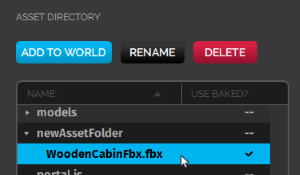
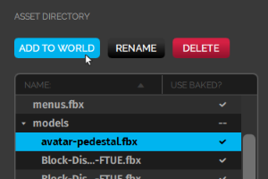
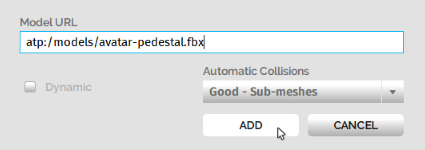

Once you've completed [setting up your domain](../your-domain), you can start building content for it. You can add content to your domain using [our creator tools](../../create/tools) or using the Asset Server.

The Asset Server allows you to host files or assets that can either be added or be referenced by entities and scripts in your domain. Assets are files available in your domain and can include 3D models, audio files for various sound effects, image files for textures and skyboxes, scripts, and more. 

**On This Page:**

+ [Add an Asset to the Asset Server](#add-an-asset-to-the-asset-server)
+ [Bake an Asset](#bake-an-asset)
+ [Add an Asset to Your Domain](#add-an-asset-to-your-domain)
+ [Edit Assets in the Asset Server](#edit-assets-in-the-asset-server)

> >>> >Files hosted on the Asset Server are only available in your domain. Do not upload avatars you wish to wear in other domains to the Asset Server.

## Add an Asset to the Asset Server

You can add, edit, and remove files from your Asset Server through the Asset Browser in your domain. Add a file from your computer to the Asset Server:

1. In Interface, pull up your HUD or Tablet and go to **Create**. 
2. In the **Create** app, click 'Open This Domain's Asset Server' to view the Asset Browser.
3. To add a file to the Asset Server, click 'Choose File' in the Asset Browser window. 
4. Select your file from your computer's directory and click 'Open'. 
5. You will need to specify a folder path before the `/asset_filename` . By default, there is no folder created for your asset. When you add a folder name, it will be automatically created in your Asset Server. 
6. Click 'OK'. You can view your asset in the Asser Browser. 

7. Once files have been uploaded to your Asset Server, they can be referenced by any entities or scripts in your domain using their URLs. You can get an asset's URL by selecting the asset, right-clicking and selecting 'Copy URL'. You can also add these assets to your domain. 

## Bake an Asset

When you upload a model to your domain, you are rendering the following: 

+ Your model's assets.
+ Geometric meshes: A geometric mesh (more commonly known as a polygon mesh) is a collection of vertices, edges, and faces that together define the shape of a model in 3D graphics and modeling.
+ Textures: Textures help in defining high frequency detail, color, or surface textures. 

Loading models in High Fidelity involves real-time rendering (drawcalls), which means images are produced and analyzed in real time. Depending on the complexity of the models, the drawcalls can differ. You can reduce the drawcalls and optimize the rendering process using baking. Baking optimizes the rendering process by compressing the poly meshes and textures in an asset. A baked model loads the smaller meshes first, cutting down on the load time. Baked textures are often larger than the original texture because they contain textures with different resolutions.

In High Fidelity, baking helps in improving the efficiency with which models are stored and transmitted. If you bake your domain content, you will reduce the initial load times for your visitors.

| File Type                                    | Baking Process                                               |
| -------------------------------------------- | ------------------------------------------------------------ |
| 3D models (FBX files with embedded textures) | Baked when uploaded to the Asset Server.                     |
| Avatars (FBX files with embedded textures)   | Baked when uploaded to the Asset Server. Avatars are usually not uploaded to the Asset Server as they are used in different domains. Avatars uploaded to the Asset Server can only be baked when their FBX files are embedded with textures. |
| JavaScript Files                             | Baked when uploaded to the Asset Server. Baking a JS file involves removing white spaces and comments in the script to shrink its size. A baked script is transmitted and interpreted faster because of its smaller size.  A baked JS file will not be very easy to read as all the white spaces and comments will be removed. If you wish to read and understand any JS files that have been baked, you will need to use its unbaked version. |

A baked file will have a check mark under the 'Use Baked?' column on the Asset Browser. A file will not bake when:

+ It is an FBX file with external textures. Only FBX files with embedded textures can be baked. This error will show up as a triangular sign under the 'Use Baked?' column.
+ It is a file type that cannot be baked. It is usually depicted by two dashes under the 'Use Baked?' column.

To bake a file again, just uncheck and check 'Use baked version'.

 ## Add an Asset to Your Domain

You can add an asset to your domain through the Asset Browser. 

1. In Interface, pull up your HUD or Tablet and go to **Create**.
2. Click 'Open This Domain's Asset Server'.
3. Select the asset you wish to add from the list displayed. 
4. Click 'Add to World'. 
5. In the window that pops up, you can view the asset's URL (Asset Server URL) in the format `atp:/$FILENAME`, and modify its collision and physics properties. Once you are done with these changes, click 'Add'. 

## Edit Assets in the Asset Server

You can use the Asset Browser to edit the assets in the following ways:

+ Remove assets from your Asset Server by selecting the asset files and clicking 'Delete'.
+ Rename assets by selecting the asset file and clicking 'Rename'.
+ Organize your assets into folders to help you find and reference them quickly.

**See Also**

+ [Textures](../../create/3d-models/pbr-materials-guide#textures)
+ [Create New Entities](../../create/entities/create-entities)
+ [Creator Tools](../../create/tools)
+ [Set Up Your Domain](../your-domain)