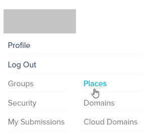

You can enter any High Fidelity domain if you have its Place Name and the right permissions. A Place Name acts like a website's URL and is a domain's unique name. 

**On This Page:**
+ [Purchase a Place Name](#purchase-a-place-name)
+ [Connect a Place Name to Your Domain](#connect-a-place-name-to-your-domain)
+ [Connect New and Existing Place Names](#connect-new-and-existing-place-names)

## Purchase a Place Name

When you set your [domain's basic server settings](../your-domain/configure-settings), your domain will be assigned a temporary place name. You can purchase a Place Name of your choice (one that better represents you or your business) from High Fidelity. 

You will need to have a High Fidelity account to purchase a Place Name. Place Names are US $20/year. You need to renew the purchase after a year to continue using it. 

1. Log in to [High Fidelity](https://highfidelity.com/). On the drop down menu under your username, click 'Places'. You can also open the page https://highfidelity.com/user/places.  
2. All your previously purchased Place Names, if any, will be listed here. Click 'Create a Place Name'.
3. Type in your new Place Name. Place Names must be 4-64 characters in length. Letters, numbers and hyphens are allowed. You can use a Place Name that is currently not purchased. 
4. Click 'Checkout Now'.
5. Enter your credit card number, PayPal account information or a coupon code to complete the purchase.

## Connect a Place Name to Your Domain

After you purchase a Place Name, you need to connect it to your domain. 

1. If you're using your local sandbox, right-click the High Fidelity icon on your system tray or top menu bar, and click 'Settings'. Or, go to the [cloud domain](https://highfidelity.com/user/cloud_domains) settings on the website.
2. In your domain server settings, under the 'Metaverse/Networking' section, click 'Advanced Settings'. Copy the Domain ID. You can also go to https://highfidelity.com/user/domains and click 'Create a New Domain' if have never created a domain before and have all your work on the sandbox. Once you create a new domain, copy the domain ID. 
3. Go to https://highfidelity.com/user/places. Edit the Place Name you purchased. 
4. Add the domain ID you copied under the 'Points To' field. 
5. Enter a ['Path'](../your-domain/configure-settings#set-an-entry-path-for-users), 'Description', and 'Preview Image' (optional).
6. Click 'Update Place'.
7. Next, configure your domain server to use the domain of your choice (in case it already isn't configured). Right-click the High Fidelity icon on your system tray or top menu bar, and click 'Settings'.
8. In your domain server settings, under the 'Metaverse/Networking' section, click 'Advanced Settings'. 
9. Under 'Domain ID' click 'Choose from my domains' and select the domain of your choice. 
10. You and other users will now be able to access your domain using Interface by typing the Place Name into the *Address Bar*. You may also use the URL `hifi://MyPlaceName`.

## Connect New and Existing Place Names

When you purchase a new Place Name, if you connect it with your domain ID, users will not be able to access your domain with the old Place Name. You can avoid this by connecting the newly purchased Place Name to the existing one. 

1. Go to https://highfidelity.com/user/places. Edit the Place Name you purchased. 
2. Add the existing Place Name under the 'Points To' field. 
3. Enter a ['Path'](../your-domain/configure-settings#set-an-entry-path-for-users), 'Description', and 'Preview Image' (optional).
4. Click 'Update Place'.
5. You and other users will now be able to access your domain using Interface by typing the Place Name into the *Address Bar*. You may also use the URL `hifi://MyPlaceName`.

**See Also**

+ [Set an Entry Path for Users](../your-domain/configure-settings#set-an-entry-path-for-users)
+ [Configure Basic Server Settings](../your-domain/configure-settings#configure-basic-server-settings)