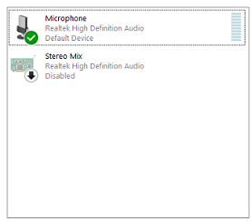
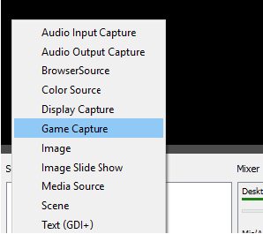

You can stream content to your High Fidelity domain, which lets you host events such as watching a football game with your friends. Or, you can go the other way, and live stream what's happening in your domain to external users. 

**On This Page **

+ [Stream Audio to Your Domain](#stream-audio-to-your-domain)
+ [Stream Video to Your Domain](#stream-video-to-your-domain)
+ [Live Stream from a Domain](#live-stream-from-a-domain)

## Stream Audio to Your Domain

When you want to stream audio from your domain, we recommend you set up another computer dedicated for streaming, with its own avatar, and use the Stereo Mix device from Windows as the audio input.

>>>>> These instructions work best on a machine with Realtek audio chipsets. 

1. Go to the Sound settings on your computer. Click the 'Recording' tab. 
2. Right-click and select 'Show Disabled Devices'. Certain new releases of Realtek drivers do not have Stereo Mix as a device. If Stereo Mix does not show up after turning on Show Disabled Devices, you can install an older version of the drivers. 
3. Select and enable 'Stereo Mix'. This will route any audio coming from your computer's sound system into High Fidelity, as if it were a microphone. 
4. In Interface, pull up your HUD or tablet and go to **Audio** and disable noise reduction to prevent the audio cutting out. If you are streaming from a stereo input, enable stereo input here. 
5. Prepare to broadcast audio. Adjust the volume on your own computer to change the volume in High Fidelity. To prevent feedback, mute High Fidelity in the Volume Mixer. Remember, you will not be able to talk while you are broadcasting audio with Stereo Mix.
6. Position the avatar within the domain. This can be tricky, so we recommend giving yourself extra time to prepare.

You can change the natural attenuation and reverb of an audio source by [creating Audio Zones](../your-domain/configure-settings#audio-environments). Audio Zones will allow you to modify the audio effects of different parts of the domain to better fit your style. 

### Troubleshooting
+ If you cannot find Stereo Mix in your audio devices, check out [this document](https://www.howtogeek.com/howto/39532/how-to-enable-stereo-mix-in-windows-7-to-record-audio/).
+ If your computer does not support Stereo Mix, check out some alternatives [here](https://mediarealm.com.au/articles/stereo-mix-setup-windows-10/).
+ If your domain visitors hear an echo, ensure that your High Fidelity audio output is muted.

## Stream Video to Your Domain

Screenleap is an external service for Windows that allows you to share your whole screen, an application window, or a screen section to the rest of the world. We use it because it works with the current web entity system for High Fidelity. With Screenleap, everyone sees the exact same video image in sync, no matter how late they come into the domain. Latency is typically less than milliseconds.

> > >> > Screenleap does not stream audio. 

1. Make an account on [screenleap.com](http://screenleap.com) and login.
2. Click on Broadcast Screen and follow the instructions to download and install the Screenleap app. 
3. Right click the green Screenleap icon on your system tray (Windows) or top menu bar (OS X) and choose START BROADCAST (not start screen share). You will be given the option to stream your entire screen, a window, or a box on your screen that you can define by dragging and stretching. Paste the URL into the web entity on which you wish to stream.

#### Troubleshooting
+ If your Screenleap video rate is too low, it may be that the bandwidth is unable to keep up with the video. To fix this, you can scale down your video player to be a small window, and then make the Broadcast Screen Area box small to only accommodate that area. This will cut down reduce the necessary bandwidth and increase the frame rate. The tradeoff is lower resolution video. 
+ If your Screenleap video resolution is too low, increase the size of your video player window. This will require more bandwidth, and may cause your video to have lower frame rate.

## Live Stream from a Domain

If you want to reach your audience through YouTube or Twitch, or your friends through Facebook Live, you can do so with the help of our live streaming guide for High Fidelity.

You can download and install OBS, our recommended streaming software, [here](https://obsproject.com/). Open Broadcaster Software (OBS) Studio is a free and open source software for video recording and live streaming. Because of the ease of availability and valuable features, we recommend using OBS for all your streaming and recording needs. 

Ensure you have the permission to live stream through the channel of your choice. 

### Set Up Your Domain for Streaming

Before you start recording and streaming, determine if this is a one-time event, or if it is a show or event, and the type of VR personality you'd like to have. 

+ Depending on your requirements, you can use your desktop, an HMD with or without controllers, or a motion capture system.
+ Download High Fidelity's [Spectator Camera](../../explore/personalize-experience/install-apps#spectator-cam) Marketplace app. 
+ Set up OBS to stream your Spectator Camera's view. 

### Set Up OBS for Streaming from High Fidelity

1. Under Sources, select **Game Capture**. This is not necessary, but we recommend this setting for streaming and recording. 
2. Ensure that your display is showing your Spectator Camera's view. 
3. If you're using an HMD, uncheck disable preview in High Fidelity. In Interface, pull up your HUD or Tablet, and go to **Menu > Display > Disable Preivew**. This is important, as OBS captures what is being displayed in a window and will not capture anything apart from the preview disabled window if you don't uncheck it. 
4.  Set your application's audio gain as -3dB so that its volume is lower than your audio. This allows you to be heard over any of the application's audio. 
5.  To see your avatar moving properly, without any jarring experiences, you have to set your fps (frames per second) to 60. You can do this in OBS by going to **File > Settings > Video**. In the window that opens, change the Common FPS Values to 60. 
6.  If you have to switch between Desktop and HMD during the show, check and change your audio inputs to allow your streaming to continue without any disruptions. 
7.  Once you've set up OBS with these High Fidelity specific settings, you can add your streaming specific settings. 
8.  You're ready! Click on Start Streaming. 

**See Also**

+ [Spectator Camera](../../explore/personalize-experience/install-apps#spectator-cam) 
+ [Edit Your Audio Environment](../your-domain/configure-settings#audio-environments)
+ [Official OBS Guide for Beginners](https://obsproject.com/forum/threads/official-overview-guide.402/) 
+ [Official OBS Guide for Advanced Users](https://obsproject.com/forum/threads/official-quick-start-guide.410/)

